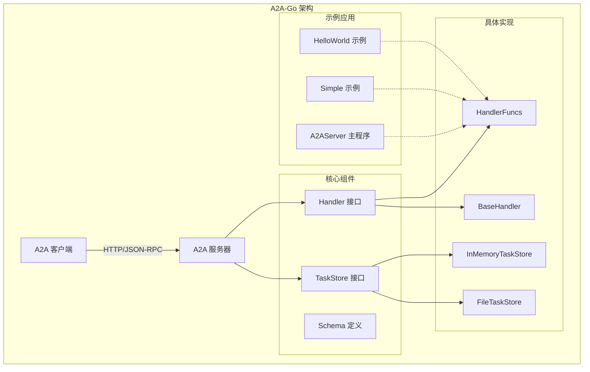
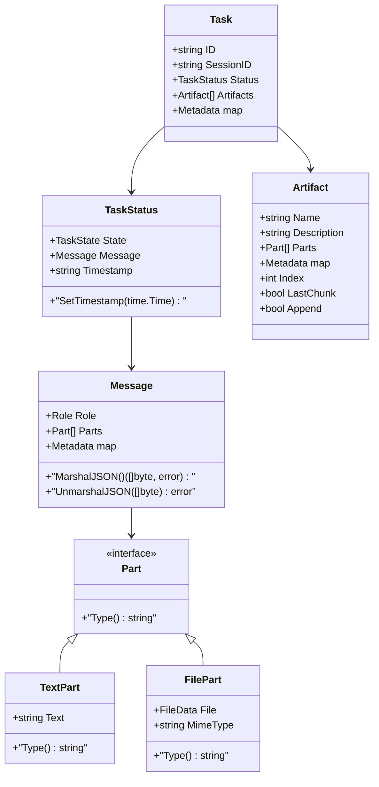
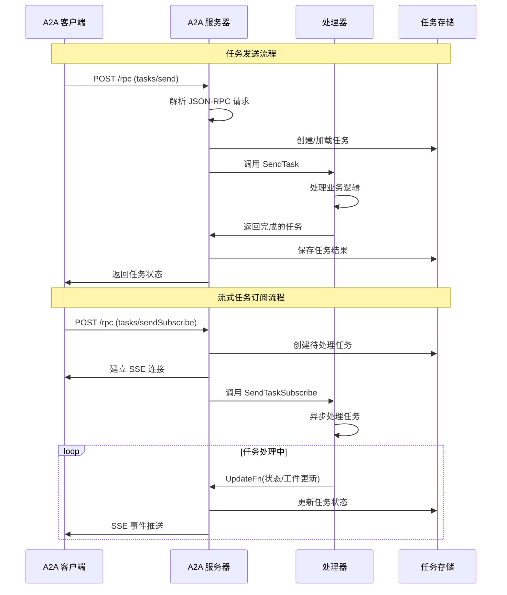
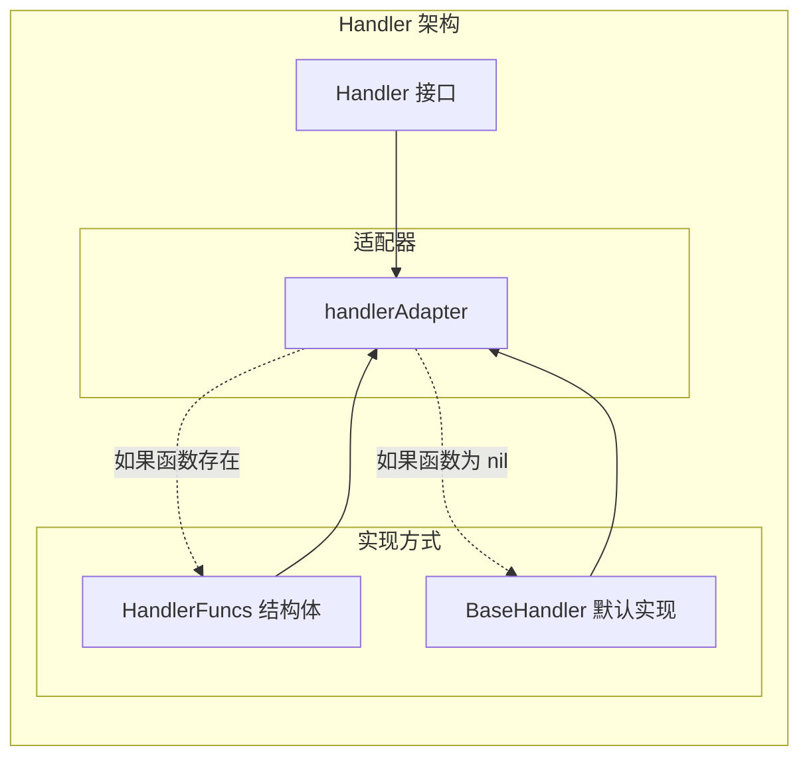
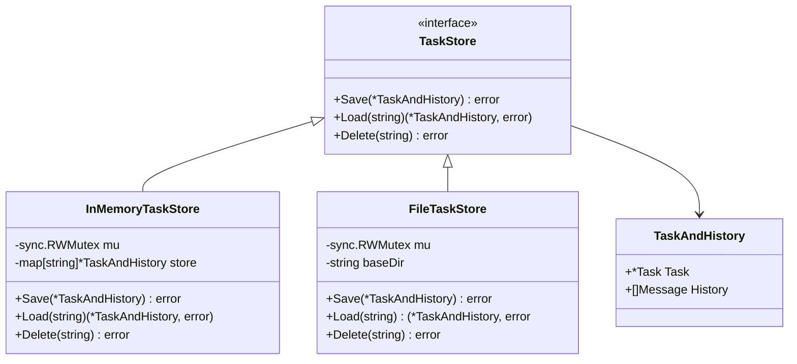
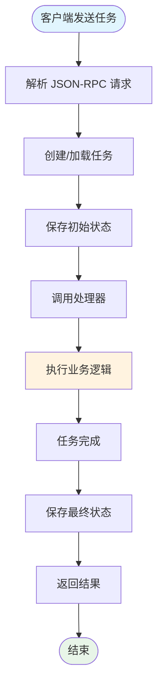
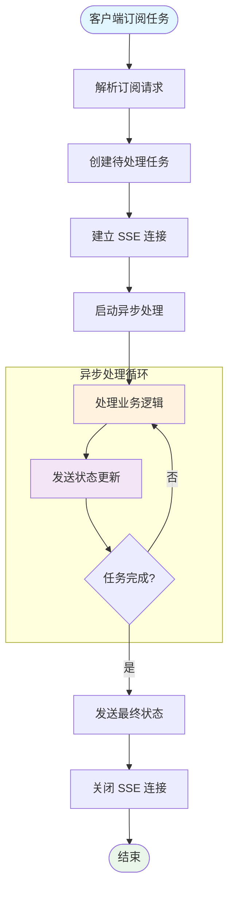
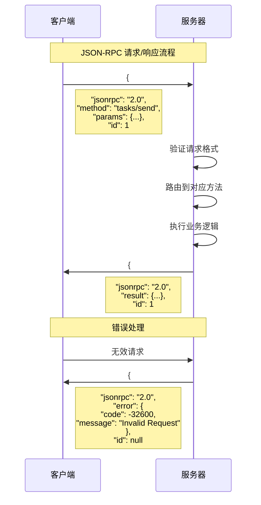
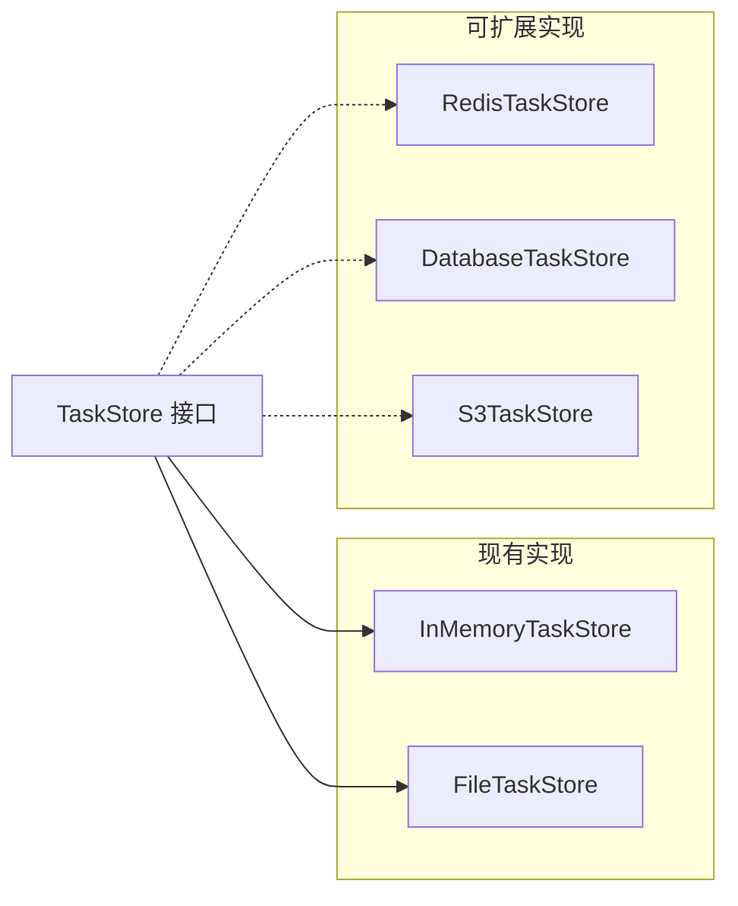
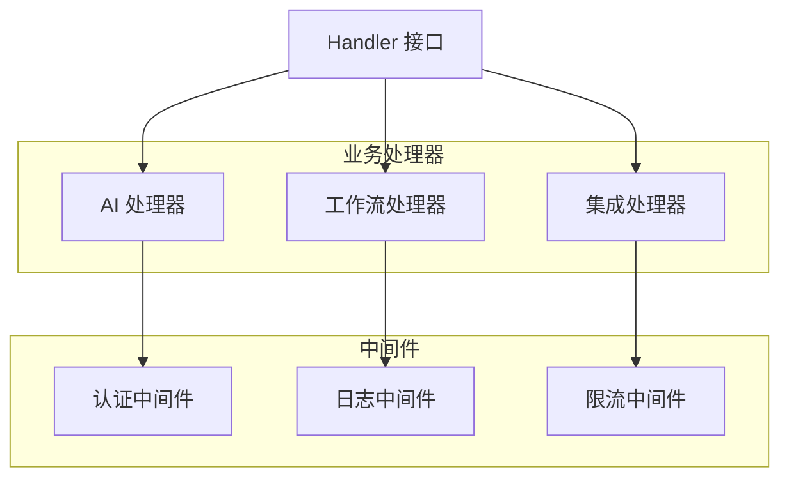

# A2A-Go 项目学习文档

## 项目概述

a2a-go 是一个用 Go 语言实现的 Agent-to-Agent (A2A) 通信协议服务器库。该项目提供了构建符合 A2A 协议的代理服务器的灵活框架，支持代理间的异步通信、任务管理和实时流式传输。

### 核心特性

- **A2A 协议合规性**: 实现核心 A2A RPC 方法和代理发现端点
- **灵活的处理器配置**: 通过 `HandlerFuncs` 结构体配置所需的 RPC 方法
- **函数式选项模式**: 使用选项模式配置服务器参数
- **可插拔任务存储**: 支持内存存储和文件存储
- **服务器推送事件 (SSE)**: 支持实时任务更新
- **默认实现**: 提供默认的任务处理逻辑

## 项目架构



## 核心模块分析

### 1. Schema 模块 (`schema.go`)

这是项目的核心数据结构定义模块，包含了所有 A2A 协议相关的类型定义。

#### 关键数据结构



**核心设计特点:**
- 使用接口 `Part` 实现多态，支持不同类型的消息内容
- 自定义 JSON 序列化/反序列化处理复杂的接口类型
- 任务状态机设计，支持 `pending`、`processing`、`completed`、`failed`、`canceled` 等状态

### 2. Server 模块 (`server.go`)

服务器模块是整个框架的核心，负责 HTTP 服务、RPC 处理和 SSE 流式传输。



**关键功能实现:**

1. **函数式选项模式**: 通过 `WithAddress`、`WithLogger`、`WithStore` 等选项配置服务器
2. **适配器模式**: `handlerAdapter` 将 `HandlerFuncs` 适配为 `Handler` 接口
3. **SSE 流式传输**: 支持实时任务状态和工件更新推送
4. **任务生命周期管理**: 从创建到完成的完整任务状态管理

### 3. Handler 模块 (`handler.go`)

处理器模块定义了业务逻辑接口和默认实现。



**设计模式分析:**
- **策略模式**: `HandlerFuncs` 允许用户只实现需要的方法
- **模板方法模式**: `BaseHandler` 提供默认实现
- **适配器模式**: `handlerAdapter` 统一接口

### 4. Store 模块 (`store.go`)

存储模块提供了任务持久化的抽象接口和具体实现。



**存储策略:**
- **内存存储**: 适用于开发和测试，性能最佳但不持久
- **文件存储**: 适用于生产环境，支持原子写入和持久化
- **可扩展性**: 通过接口设计支持数据库等其他存储后端

## 任务处理流程

### 同步任务处理



### 异步流式任务处理



## 示例应用分析

### HelloWorld 示例

最简单的 A2A 代理实现，展示了基本的同步任务处理：

```go
// 核心处理逻辑
func handleHelloWorldTask(ctx *a2a.TaskContext) (*a2a.Task, error) {
    // 创建响应消息
    helloMessage := a2a.Message{
        Role:  a2a.RoleAgent,
        Parts: []a2a.Part{a2a.TextPart{Text: "Hello World!"}},
    }
    
    // 更新任务状态为完成
    finalTask := ctx.CurrentTask
    finalTask.Status.State = a2a.StateCompleted
    finalTask.Status.Message = &helloMessage
    finalTask.Status.SetTimestamp(time.Now())
    
    return finalTask, nil
}
```

### Simple 示例

展示了更复杂的同步任务处理，包括输入解析和工件生成：

```go
func handleSimpleEchoTask(ctx *a2a.TaskContext) (*a2a.Task, error) {
    // 解析输入
    inputText := "(No text part found)"
    if len(ctx.Message.Parts) > 0 {
        if textPart, ok := ctx.Message.Parts[0].(a2a.TextPart); ok {
            inputText = textPart.Text
        }
    }
    
    // 生成响应和工件
    responseText := fmt.Sprintf("Echoing back: '%s'", inputText)
    completionMessage := a2a.Message{
        Role:  a2a.RoleAgent,
        Parts: []a2a.Part{a2a.TextPart{Text: responseText}},
    }
    
    responseArtifact := a2a.Artifact{
        Name:  "echo_result",
        Parts: []a2a.Part{a2a.TextPart{Text: fmt.Sprintf("Processed: %s", inputText)}},
    }
    
    // 更新任务状态
    finalTask := ctx.CurrentTask
    finalTask.Status.State = a2a.StateCompleted
    finalTask.Status.Message = &completionMessage
    finalTask.Status.SetTimestamp(time.Now())
    finalTask.Artifacts = []a2a.Artifact{responseArtifact}
    
    return finalTask, nil
}
```

### A2AServer 主程序

展示了流式任务处理的完整实现：

```go
func handleSendTaskSubscribe(ctx *a2a.TaskContext) (*a2a.Task, error) {
    // 启动异步处理
    go func() {
        // 发送处理中状态
        workingStatus := a2a.TaskStatus{State: a2a.StateProcessing}
        ctx.UpdateFn(workingStatus)
        
        // 发送工件
        artifact := a2a.Artifact{
            Parts: []a2a.Part{a2a.TextPart{Text: "Processed input"}},
        }
        ctx.UpdateFn(artifact)
        
        // 发送完成状态
        completedStatus := a2a.TaskStatus{
            State:   a2a.StateCompleted,
            Message: &completionMessage,
        }
        ctx.UpdateFn(completedStatus)
    }()
    
    return ctx.CurrentTask, nil
}
```

## 协议实现细节

### JSON-RPC 2.0 支持

项目完全实现了 JSON-RPC 2.0 规范：



### 代理发现机制

通过 `/.well-known/agent.json` 端点实现代理发现：

```json
{
  "name": "Go Simple Example Agent",
  "description": "A basic Go agent demonstrating the a2a-go library.",
  "url": "http://localhost:8080",
  "version": "0.1.0",
  "capabilities": {
    "streaming": true,
    "pushNotifications": false
  },
  "authentication": {
    "schemes": ["None"]
  },
  "skills": [
    {
      "id": "simple_echo",
      "name": "Simple Echo Task",
      "description": "Echoes back the input message"
    }
  ]
}
```

## 设计模式总结

1. **策略模式**: `HandlerFuncs` 允许灵活配置处理策略
2. **适配器模式**: `handlerAdapter` 统一不同的处理器实现
3. **模板方法模式**: `BaseHandler` 提供默认实现模板
4. **观察者模式**: SSE 机制实现任务状态变化通知
5. **工厂模式**: `NewServer` 函数创建配置好的服务器实例
6. **接口隔离**: `TaskStore`、`Handler` 等接口职责单一
7. **依赖注入**: 通过函数式选项注入依赖

## 扩展性分析

### 存储后端扩展



### 处理器扩展



## 性能考虑

1. **并发安全**: 所有存储实现都使用读写锁保证并发安全
2. **内存管理**: 任务和历史记录的深拷贝避免数据竞争
3. **流式传输**: SSE 支持大量并发连接的实时更新
4. **错误处理**: 完善的错误处理和恢复机制
5. **资源清理**: 自动清理断开的 SSE 连接

## 总结

a2a-go 项目是一个设计良好的 A2A 协议实现，具有以下优点：

- **模块化设计**: 清晰的模块分离和职责划分
- **可扩展性**: 通过接口和适配器模式支持灵活扩展
- **易用性**: 提供简单的 API 和丰富的示例
- **标准合规**: 完全符合 A2A 协议规范
- **生产就绪**: 支持并发、错误处理和资源管理

该项目为构建 Agent-to-Agent 通信系统提供了坚实的基础，可以作为学习现代 Go 项目架构和协议实现的优秀案例。